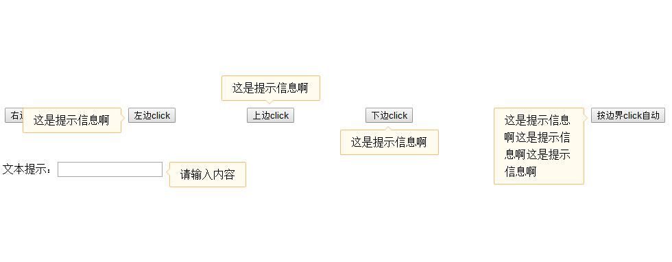

# tip
jquery提示组件,动态内容tip,右键菜单tip提示
效果如下图:

**[DEMO请案例点击这里查看.](http://tianxiangbing.github.io/tip/example/ "tip demo")**

----------

# 调用示例
	<table style="width:100%;"><tr>
		<td>
			<input type="button" value="右边hover" id="btn-tip-right">
		</td>
		<td>
			<input type="button" value="左边click" id="btn-tip-left">
		</td>
		<td>
			<input type="button" value="上边click" id="btn-tip-top">
		</td>
		<td>
			<input type="button" value="下边click" id="btn-tip-bottom">
		</td>
		<td align="right">
			<input type="button" value="按边界click自动" id="btn-tip-auto">
		</td>
	</tr></table>
	文本提示：<input type="text" id="txt-tip" msg="请输入内容">
	
	
	

# API
## 属性
### trigger:`[$|dom|string]`
	触发元素,jquery对象或dom或string,当delegate不为空时，trigger只支持string.
### triggerEvent: `[click|hover|focus]`
	触发事件，默认为hover,事件都委托在delegate参数上，focus不委托
### delegate:`[dom|string]`
	事件的委托节点,默认无委托,focus无效.
### tpl:`[string]`
	html模板，默认

<i></i><em></em>

### offset:`{x:0,y:0}`
	偏移量,默认x:0,y:0
### width:`[number]`
	宽
### height:`[number]`
	高
### zIndex:`999`
	z-index
### content:[string|$]
	提示内容，这里可以是string或节点，因为内部是调用的$().html方法,动态设置请调setContent方法
### inViewport:`bool`
	是否自适合窗口位置,默认false
### position:`['right'|'left'|'top'|'bottom']`
	显示位置，默认'right
### ajax:`function`
	返回一个promise,参数为promise之后的内容如下：
	ajax: function() {
		var dtd = $.Deferred(); // 新建一个deferred对象
		var wait = function(dtd) {
			var tasks = function() {
				console.log("执行完毕！");
				dtd.resolve("这是提示信息啊"); // 改变deferred对象的执行状态
			};
			setTimeout(tasks, 1000);
			return dtd;
		};
		wait(dtd);
		return dtd;
	}
## 方法
### setContent:`function(content)`
	设置提示内容
### stop:`function()`
	停止显示
### start:`function`
	开始显示
## 事件或回调
### callback:`function`
	显示后的回调
### hide:`event`
	tip的hide事件，
### beforeShow:`function`
	显示前的回调
### afterHide:`function`
	隐藏后的回调